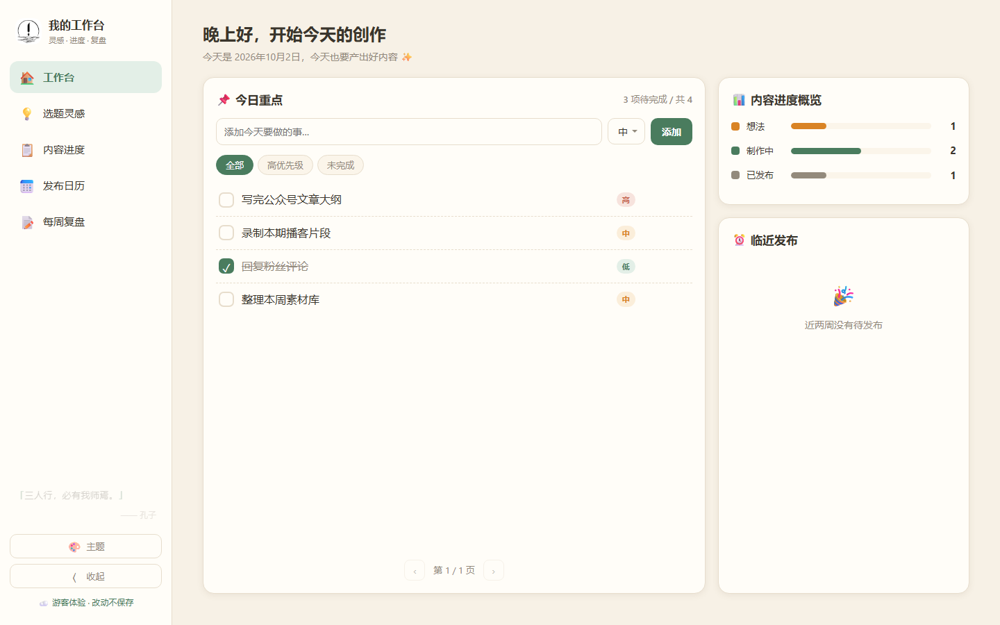
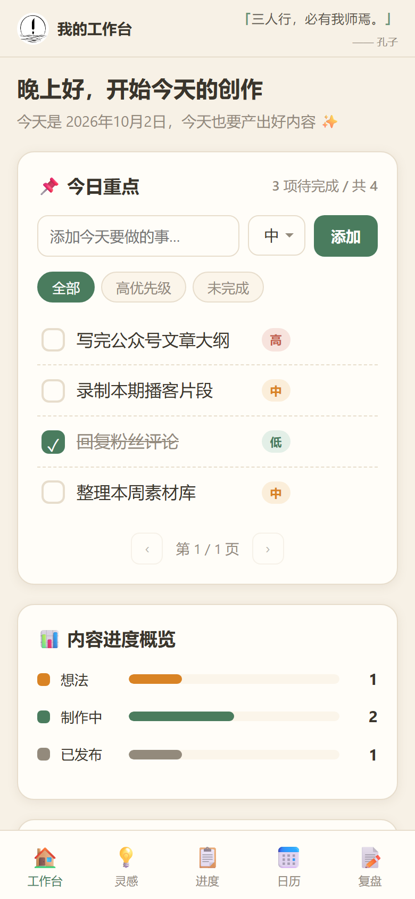
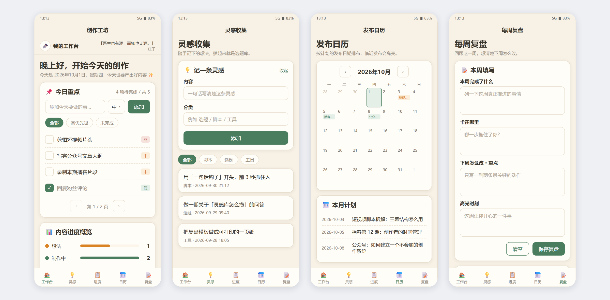
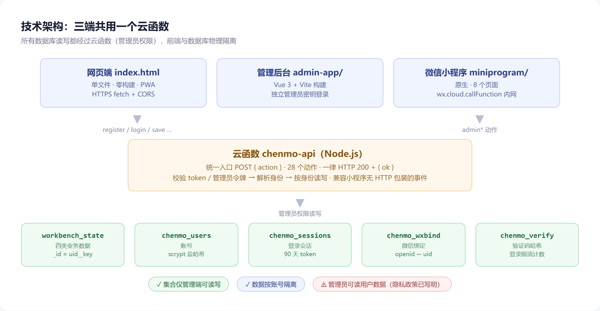
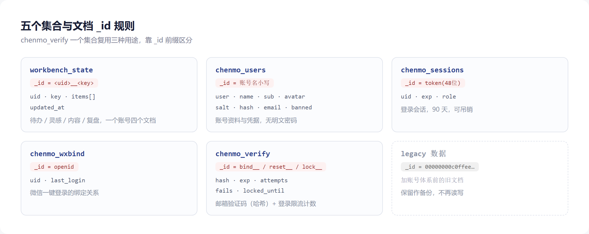
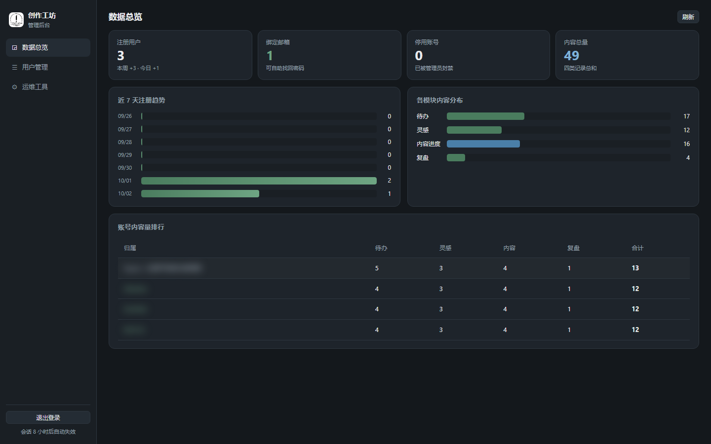
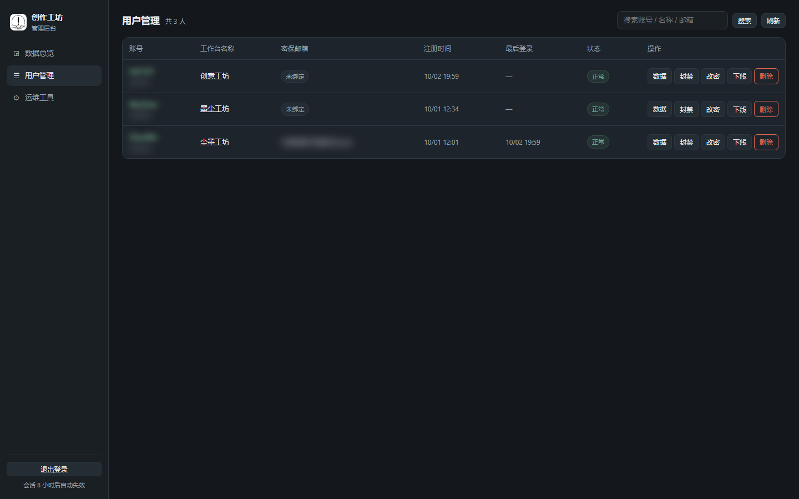
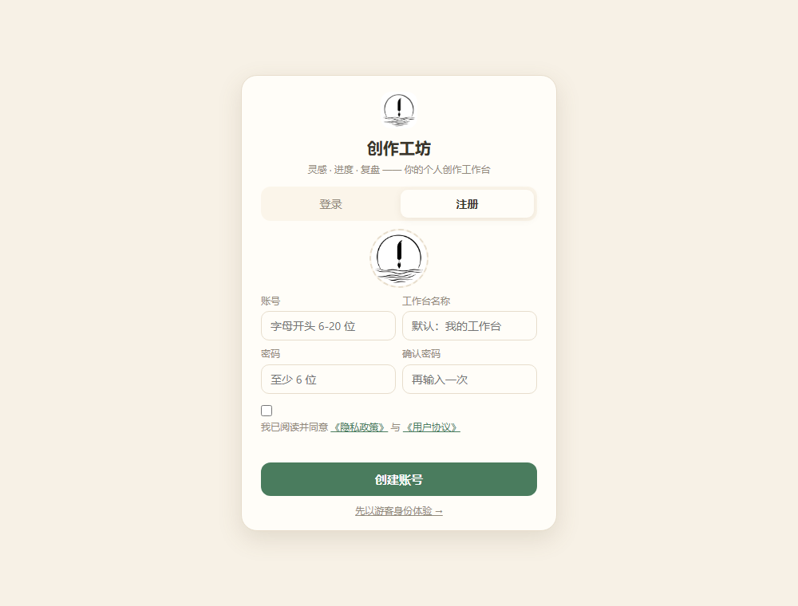
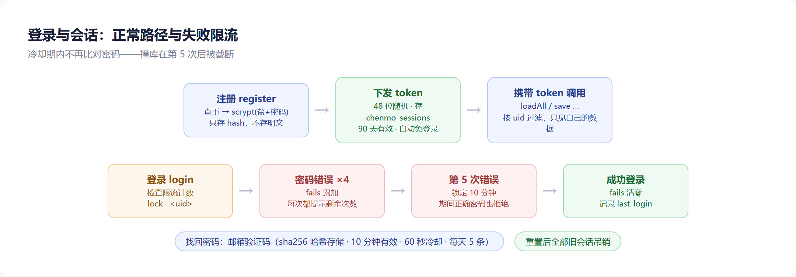

# 创作工坊 · Chenmo Studio

**一个单文件的个人创作工作台：待办 / 灵感 / 内容 / 复盘，数据存腾讯云开发 CloudBase，多设备自动同步，带完整账号体系、独立管理后台与微信小程序。**

**A single-file personal workbench — tasks, ideas, content and reviews in one page, with a real account system, an admin console, a WeChat mini program, and cloud sync via Tencent CloudBase. Zero build step for the frontend.**

[](https://chenmo-studio.app.workbuddy.host/)
[](https://chenmo-studio.app.workbuddy.host/admin-app/)


> 整个前端就是**一个 `index.html`**：没有框架、没有 npm、没有打包、没有构建步骤。双击能开，扔到任何静态托管也能跑。
> 后端是**一个云函数 + 五个数据集合**，免费额度对个人使用绰绰有余。

---

## 目录

- [这是什么](#这是什么)
- [界面速览](#界面速览)
- [功能特性](#功能特性)
- [技术架构](#技术架构)
- [数据模型](#数据模型)
- [接口一览](#接口一览)
- [自部署指南](#自部署指南)
- [二次创作：配套技能包](#二次创作配套技能包)
- [目录结构](#目录结构)
- [微信小程序（已接云端）](#微信小程序已接云端)
- [管理后台（admin/）](#管理后台admin)
- [隐私与合规](#隐私与合规)
- [成本与续期](#成本与续期)
- [安全说明](#安全说明)
- [测试](#测试)
- [踩坑记录](#踩坑记录)
- [详细技术文档](docs/TECHNICAL.md)
- [更新日志](CHANGELOG.md)

## 界面速览

**网页端**（暖纸主题，游客模式的示例数据）

| 桌面端 | 移动端 |
|---|---|
|  |  |

**微信小程序**（与网页端同一账号、同一份数据）



## 这是什么

一个给自己用的工作台。它把日常创作里最常打交道的四件事收在了一个页面里，并且解决了一个小工具最容易忽略的问题——**换台设备内容就没了**。

所以它的数据不在浏览器里，而在云端：手机加进主屏幕、电脑开浏览器，看到的是同一份内容。再加上一套账号体系，它就从「一个人的本地小工具」变成了「可以给别人用的在线产品」——每个人有自己的账号、自己的工作台名称和头像，数据互不可见。

适合这些人：需要轻量个人管理工具的创作者、想找一个**可读可改的单文件全栈示例**来学 CloudBase 的开发者、以及想把「单文件页面 + Serverless 后端」这套做法复制到自己项目上的人。

## 功能特性

**四大模块**

| 模块 | 用途 | 存储键 |
|---|---|---|
| 待办 | 带优先级的任务清单，勾选完成、拖动排序 | `todos` |
| 灵感 | 随手记下来的想法，不打断思路 | `ideas` |
| 内容 | 创作内容的进度管理 | `contents` |
| 复盘 | 定期回顾与总结 | `reviews` |

**账号体系**（完整自研，不依赖 CloudBase 内置登录）

- 注册 / 登录 / 退出，账号规则同微信号：6–20 位、字母开头，只能含字母、数字、下划线、中划线
- 密码用 `scrypt` 加 16 字节随机盐派生，不存明文；比对走恒定时间算法（防时序侧信道）
- **登录失败限流**：同一账号连续输错 5 次即冷却 10 分钟，冷却期内连密码都不再比对（防撞库）
- **密保邮箱 + 自助找回密码**：绑定邮箱后，忘记密码可用邮箱验证码自助重置（免费 SMTP 发信，不依赖短信）；重置后全部旧登录态失效
- **微信扫码登录（网页版）**：网页显示配对二维码，小程序「网页登录授权」扫码/输码确认后免密进入——官方网页扫码登录需企业资质，此处用小程序当授权钥匙自建实现
- **自助注销账号**：资料弹窗内可自行注销，需验证密码 + 手输账号名，注销后账号、会话、邮箱、微信绑定与全部数据永久清除
- 登录下发 90 天 token，二次打开自动免登录
- **数据按账号隔离**：每个账号只查得到自己的内容
- 可自定义工作台名称、副标题与头像（图片本地压缩到 256×256 再上传）
- **游客体验模式**：无需注册即可浏览示例数据，但改动不写入云端

**每日名言**

- 内置 162 条中外哲学家词库（中方 72 条 / 西方 90 条）
- 每天 10 条，**中方 5 条与西方 5 条交替**出现
- 每 2.4 小时按时段自动轮换一条，午夜自动换新的一天
- 点一下切换下一条，点满 10 次精确回到当天第一条

**其他**

- PWA：可添加到主屏幕，像原生 App 一样打开
- 断网时保存失败会明确提示且不丢内容，恢复后自动重试
- 浏览器本地**只存登录 token 和主题偏好**，业务数据一条不落地
- 四套主题：暖纸 / 极简 / 专注（深色）/ 科技（深色）

## 技术架构



**为什么用云函数代理，而不是前端直连 JS SDK？**

这是本项目最关键的一个架构决定，原因是两条硬限制：体验版 CloudBase 环境无法添加自定义安全域名；而 CloudBase 的测试域名在浏览器里直接导航时会触发微信风控提示页。把页面托管在别处、让云函数在云端用管理员权限读写数据库，两个问题一起解决。

代价是：这个 HTTP 地址写死在前端里，等于公开。所以所有安全边界都必须落在云函数内部（token 校验、限流、管理员密钥），不能依赖 CORS 或前端隐藏——这一点在[安全说明](#安全说明)里展开讲。

**云函数的关键设计**

| 设计 | 做法 | 原因 |
|---|---|---|
| 统一响应 | 一律 HTTP 200 + `{ok:false, ...}` | 跨域场景下前端读不到 401 响应体的语义 |
| 参数解析 | 有 `event.body` 走 HTTP，否则用 event 自身 | 小程序 `wx.cloud.callFunction` 的事件没有 HTTP 包装 |
| 取单文档 | `getDoc()` 统一 try/catch 返回 null | SDK 在文档不存在时会抛错，不处理会误判注册查重 |
| 鉴权失败 | 返回 `needAuth` / `needAdminAuth` | 前端据此跳登录，而不是弹一个看不懂的错误 |
| 管理员 | 未配置 `ADMIN_KEY` 时所有管理动作拒绝 | fail-closed：配错了宁可不可用，也不能无鉴权 |

## 数据模型



五个集合，全部建议设为**「仅管理端可读写」**（见[自部署第 2 步](#2-创建五个集合并设置权限)）：

| 集合 | `_id` | 用途 | 主要字段 |
|---|---|---|---|
| `workbench_state` | `<uid>__<key>` | 四类业务数据 | `uid` `key` `items`（数组）`updated_at` |
| `chenmo_users` | 账号名小写 | 账号 | `user` `name` `sub` `avatar` `salt` `hash` `email` `banned` `created_at` `last_login` |
| `chenmo_sessions` | token（48 位十六进制） | 登录会话 | `uid` `exp`（90 天）`role` |
| `chenmo_wxbind` | openid | 微信 ↔ 账号绑定 | `uid` `last_login` |
| `chenmo_verify` | `bind__<uid>` / `reset__<uid>` / `lock__<uid>` | 邮箱验证码与登录限流计数 | `hash`（sha256）`exp` `attempts` `fails` `locked_until` |

> 老数据迁移：`uid` 为 `chenmo` 的账号首次登录时，会自动把加账号体系之前的老文档复制成 `chenmo__*`（原文档保留作备份）。该行为是一次性且幂等的。

## 接口一览

云函数共 28 个动作，统一通过 `POST { action, ... }` 调用。

**公开（无需登录）**

| 动作 | 用途 |
|---|---|
| `ping` | 健康检查，页面启动时验活 |
| `getQuote` / `getDayQuotes` | 每日名言 |
| `register` / `login` | 注册 / 登录，返回 token |
| `sendEmailCode`（reset） | 找回密码发验证码 |
| `resetPassword` | 凭邮箱验证码重置密码 |
| `pairCreate` / `pairPoll` | 网页生成配对码 / 轮询换取 token |

**需要用户 token**

| 动作 | 用途 |
|---|---|
| `loadAll` / `save` / `importAll` | 读取全部数据 / 保存某模块 / 批量导入 |
| `me` / `logout` / `updateProfile` | 验活 / 退出 / 改资料 |
| `sendEmailCode`（bind）/ `bindEmail` | 绑定或换绑密保邮箱 |
| `deleteAccount` | 自助注销（需密码 + 手输账号名） |
| `pairConfirm` | 小程序确认网页配对登录 |
| `wxlogin` / `wxbind` / `wxunbind` | 微信身份绑定（仅小程序内可用） |

**需要管理员令牌**（由 `adminLogin` 用 `ADMIN_KEY` 换取，8 小时有效）

| 动作 | 用途 |
|---|---|
| `adminLogin` / `adminLogout` | 换取 / 吊销管理员令牌 |
| `adminStats` / `adminUsers` / `adminUserDetail` | 总览指标 / 用户列表 / 单用户数据明细 |
| `adminUserAction` | 封禁、解封、改密、强制下线、解绑邮箱、删号 |
| `adminOps` | 扫描并清理过期会话与验证码、登出全部管理员 |

> `save` 的参数是 `{ key, items }`（**不是 `data`**）；`adminLogin` 返回的令牌字段是 `token`。这两个名字在二次开发时最容易踩。

## 自部署指南

想跑在自己的环境里，照做即可。全程大约十分钟，不需要写一行新代码。

### 1. 创建 CloudBase 环境

登录 [腾讯云开发控制台](https://tcb.cloud.tencent.com/dev)，创建环境（**上海地域**、云数据库类型）。

免费体验版有效期 6 个月、每月 3000 资源点，本项目个人使用实测约 30–60 点/月。

### 2. 创建五个集合并设置权限

在数据库里创建：`workbench_state`、`chenmo_users`、`chenmo_sessions`、`chenmo_wxbind`、`chenmo_verify`。

**五个集合的权限都设为「仅管理端可读写」。**

> 加了账号体系之后，**所有数据库读写都经过云函数**（管理员权限），前端不再直连数据库，
> 所以集合对外可以完全关闭读写——既满足跨设备同步，又不会把数据暴露在公网。
> 如果沿用老的「读写全开」规则，等于把数据库挂在公网上，请务必改掉。

### 3. 部署云函数

```bash
cd functions/chenmo-api
npm install
```

仓库根目录已提供 `cloudbaserc.json`，锁定了运行时与内存配置：

```json
{
  "version": "2.0",
  "envId": "<改成你的环境ID>",
  "functions": [{
    "name": "chenmo-api",
    "handler": "index.main",
    "runtime": "Nodejs16.13",
    "memorySize": 256,
    "timeout": 20,
    "installDependency": true
  }]
}
```

然后部署（`--force` 必须带，否则会卡在覆盖确认的交互提示上）：

```bash
npm install -g @cloudbase/cli
tcb login
tcb fn deploy chenmo-api --env-id <你的环境ID> --force
```

> **两个必踩的坑**：
> 1. 不加 `--force` 时，CLI 会弹 `overwrite? (y/N)` 等待确认，在脚本/后台里会一直挂起。
> 2. 不给 `cloudbaserc.json` 时，CLI 会「智能推断」配置，把运行时改成新版本并申请超限内存，
>    导致 `UpdateFunctionConfiguration` 报 `LimitExceeded.Memory`、函数状态变 `Update failed`。
>    超时也建议设为 20 秒——发验证码要走 SMTP，3 秒的默认超时偏紧。

首次创建的函数需要在控制台开启 **HTTP 访问服务**，拿到默认域名，形如：

```
https://<环境ID>-<后缀>.ap-shanghai.app.tcloudbase.com/chenmo-api
```

### 4. 配置云函数环境变量

在云函数的「环境变量」中配置：

| 变量 | 必填 | 说明 |
|---|---|---|
| `ADMIN_KEY` | 管理后台 | 管理员密钥。**不配置时管理后台不可用**（fail-closed），请设置足够长的随机串 |
| `SMTP_HOST` / `SMTP_PORT` / `SMTP_USER` / `SMTP_PASS` | 邮箱功能 | 发信邮箱与授权码，不配置则「找回密码」不可用（其余功能不受影响） |
| `WX_OPENID` | 小程序 | 微信身份透传相关 |

### 5. 修改两处配置

**`index.html`** 脚本开头有一块配置区（约第 970 行，有注释标注）：

| 常量 | 说明 |
|---|---|
| `CB_ENV` | 你的环境 ID |
| `CB_API` | 你的云函数 HTTP 访问地址 |
| `HOME_URL` | 你部署静态页的正式地址 |
| `OLD_HOSTS` | 曾用过、需要跳转的旧域名（没有就留空数组） |

**`functions/chenmo-api/index.js`** 中的 `ALLOW_ORIGINS`：加入你的静态页域名。

> 文件里已经写好了逻辑：所有 `*.app.workbuddy.host` 的域名一律放行，所以如果你也用这个域名托管，可以不改。

### 6. 决定要不要开放注册

```js
const ALLOW_REGISTER = true;   // 本仓库当前为 true（完全开放）
```

**当前仓库默认是开放的**（v3.5 起），这是项目作者的选择：既然要给别人用，就不设门槛。代价与防护如下：

| 风险 | 现状 |
|---|---|
| 陌生人批量建号刷资源点 | 存在。已由登录限流与验证码频率限制缓解，但无法根治 |
| 撞库试密码 | **已防护**：连错 5 次冷却 10 分钟 |
| 账号表膨胀挤占免费额度 | 需自行关注控制台用量 |

**如果你只是自己用，建议改成 `false`**：打开注册 → 建好你的账号 → 改回 `false` 重新部署。这样陌生人无法建号，你的额度只服务你一个人。

### 7. 托管静态页

`index.html` + `logo.jpeg` + `privacy.html` + `qrcode.min.js` 扔到任意静态托管：CloudBase 静态托管、GitHub Pages、对象存储 + CDN 都可以。没有构建步骤。

> 如果仓库根目录含 `miniprogram/`，某些托管平台会把整个项目误判为小程序项目。发布前把它临时移出即可。

### 8. 完成

首次打开页面时，云端无数据会自动写入空的初始结构，无需手动建数据。

## 二次创作：配套技能包

仓库里的 [`skills/`](skills/) 目录附带**两个可直接使用的 WorkBuddy 技能包**，是本项目真实走过的两条路，用来把这套做法复制到你自己的项目上。

| 技能包 | 用途 |
|---|---|
| [`workbench-cloud-sync-upgrade`](skills/workbench-cloud-sync-upgrade/SKILL.md) | 把已有项目的数据（localStorage / IndexedDB / mock JSON）迁到 CloudBase，含扫描、选型、迁移、验收全流程 |
| [`workbench-cloudbase-auth`](skills/workbench-cloudbase-auth/SKILL.md) | 给已上云的单文件工作台加注册登录、token 会话、按账号隔离数据、游客模式 |

**安装方式**——把目录复制到 WorkBuddy 技能目录即可：

```bash
cp -r skills/workbench-cloud-sync-upgrade ~/.workbuddy/skills/
cp -r skills/workbench-cloudbase-auth   ~/.workbuddy/skills/
```

**使用方式**——用大白话描述目标，技能会自动匹配：

- 「把这个项目的客户列表数据存到 CloudBase」→ 触发 `workbench-cloud-sync-upgrade`
- 「给这个工作台加注册登录，每个账号看到自己的数据」→ 触发 `workbench-cloudbase-auth`

**使用顺序不能反**：先上云（技能一），再加账号（技能二）。第二个技能强依赖第一个建好的云函数代理。

> 详细说明（含每个技能的完整流程、前置条件与设计取舍）见 [skills/README.md](skills/README.md)。

## 目录结构

```
.
├── index.html                        # 全部前端：页面 + 样式 + 逻辑（单文件，2446 行）
├── privacy.html                      # 隐私政策与用户协议（注册页勾选链接指向此页）
├── logo.jpeg                         # 默认头像
├── qrcode.min.js                     # 本地二维码库（配对登录用，不依赖外网 CDN）
├── cloudbaserc.json                  # 云函数部署配置（锁定运行时/内存/超时）
├── functions/
│   └── chenmo-api/
│       ├── index.js                  # 云函数：鉴权 + 数据读写 + 名言词库（1203 行）
│       ├── package.json
│       └── package-lock.json
├── admin/                            # 管理后台源码（Vue3 + Vite）
│   ├── src/{views,api.js,router.js,App.vue,main.js,style.css}
│   ├── index.html
│   ├── vite.config.js                # outDir 指向 ../admin-app
│   └── README.md
├── admin-app/                        # 后台构建产物（随主站一同发布为子路径）
├── miniprogram/                      # 微信小程序（8 个页面，已接云端）
├── mp-assets/                        # 小程序备案/宣传用素材
├── skills/                           # 配套技能包（二次创作用）
│   ├── README.md
│   ├── workbench-cloud-sync-upgrade/SKILL.md
│   └── workbench-cloudbase-auth/SKILL.md
├── docs/
│   ├── TECHNICAL.md                 # 详细技术文档（接口契约 / 错误码 / 本地开发）
│   └── images/                      # README 用图（界面截图与示意图）
├── CHANGELOG.md                     # 更新日志
├── LICENSE
└── README.md
```

## 微信小程序（已接云端）

`miniprogram/` 是与网页版视觉一致的微信小程序工程，共 **8 个页面**：登录、工作台、灵感、进度、日历、复盘、资料、网页登录授权。**数据层已接入云端**，与网页版共用同一账号与数据：

- **微信一键登录**：云函数 `wxlogin` / `wxbind` / `wxunbind` 动作，小程序内通过 `wx.cloud.callFunction` 调用（微信内网通道，免合法域名、免备案域名配置）；首次登录可输入网页版账号密码完成绑定，之后免密直达
- **云端同步**：`app.js` 内置完整云端数据层——token 验活 + 全量拉取、本地脏检测增量上传、离线改动进待补队列、连接就绪后自动补传；云端未就绪时提交的改动不丢失
- **目录结构**：`config.js`（环境配置）→ `utils/cloud.js`（云调用与 token 管理）→ `utils/api.js`（语义化接口封装）→ 各页面按需调用

上线前仍需：注册小程序取得 AppID，并完成 **ICP 备案**（管局终审 1–20 个工作日）。

预览方式：微信开发者工具 → 导入项目 → 选择 `miniprogram/` 目录（游客 AppID 可预览界面，云端登录需填入真实 AppID）。

## 管理后台（admin/）

用户端是零构建的单文件，服务端是这个之外的第三块：**一个用 Vue 3 + Vite 构建的独立管理后台**，两者完全分离，通过同一云函数的 `admin*` 动作读写数据。

```
用户端 index.html  ──fetch──┐
                            ├──> 云函数 chenmo-api ──> CloudBase 数据库
管理后台 admin-app/ ──fetch──┘      （admin* 动作）
```

**访问**：https://chenmo-studio.app.workbuddy.host/admin-app/

| 数据总览 | 用户管理 |
|---|---|
|  |  |

| 模块 | 能力 |
|---|---|
| 数据总览 | 注册/绑邮箱/停用/内容量四项指标，近 7 天注册趋势，四模块分布，账号内容量排行 |
| 用户管理 | 搜索、封禁/解封、重置密码、强制下线、解绑邮箱、删除账号 |
| 用户详情 | 按四个模块展开任意账号的真实数据明细 |
| 运维工具 | 清理过期会话与验证码、一键登出全部管理员 |

**安全设计**：后台用**独立管理员密钥**（云函数环境变量 `ADMIN_KEY`）登录，与普通账号体系完全隔离；令牌仅 8 小时有效；未配置密钥时所有管理动作自动拒绝；删号需手输账号名确认，且会连带清除该账号全部数据。

**构建**：`cd admin && npx vite build`，产物输出到 `../admin-app`，随主站一同发布为 `/admin-app/` 子路径。

详细的开发、构建与部署说明见 [`admin/README.md`](admin/README.md)。

## 隐私与合规

v3.7 起补齐了账号类产品的基本合规项：



- **隐私政策与用户协议**：独立页面 [`privacy.html`](privacy.html)，写明收集范围、用途、境内存储、用户权利（查阅/更正/导出/删除/注销）、保留期限与联系方式
- **注册需勾选同意**：注册表单带协议勾选框与链接，未勾选无法创建账号
- **自助注销**：用户可自行注销并清除全部数据（合规要求：必须提供且不得设置不合理障碍）
- **登录限流**：防撞库，保护用户账号不被试开

政策文本里有一节是刻意写明的：**运营者（持有管理员密钥的人）在技术上可以读取用户数据**。这是托管架构的固有事实，写清楚比回避更诚实——也避免审核时被认定为隐瞒。如果你要对外运营，请据实修改该页的联系方式与运营主体信息。

**如果目标是正式上架应用商店**，还差这几项（缺一项就难过审）：ICP 备案、小程序用户隐私保护指引配置、账号自助注销（已完成）、登录限流（已完成）、隐私政策文本（已完成）。

## 成本与续期

- 免费体验版每月 **3000 资源点**，本项目个人使用实测约 **30–60 点/月**（占比 1–2%）
- 计费单价（上海地域）：文档数据库调用 200 点/万次，云函数调用 13.3 点/万次，函数 GBs 0.111 点，外网出流量 800 点/GB
- 按此折算，3000 点大约可以支撑 **50–100 个正常活跃用户**；要对外开放到上百人，建议升级个人版（¥19.9/月，40000 点）
- 体验版有效期 6 个月，**只能在到期前 1 个月内续期**，单次续 6 个月
- 到期后进入停服隔离期（约 15 个自然日），再不续费环境将被销毁、数据不可恢复

**请务必在腾讯云控制台配好到期提醒（短信 / 微信），或自己设个日历提醒。**

> 真正的风险不是花钱，而是**忘记续期导致环境销毁、数据不可恢复**。

**数据备份**：控制台 → 数据库 → `workbench_state` → 导出 JSON。建议每次大改前导出一份。

## 安全说明

这是一个**公开部署的开源项目**，所以把已知的安全边界写在明处，方便你评估后再决定要不要照搬：



**已经做到的**

- **密码存储是标准的**：`scrypt` + 16 字节随机盐派生 32 字节密钥，比对走 `timingSafeEqual`，数据库里没有明文，源码里也没有
- **登录限流**：同一账号连错 5 次冷却 10 分钟，冷却期内不再比对密码（v3.7 实测：第 5 次起返回「密码错得太多了，请 10 分钟后再试」，冷却期内即使输入正确密码也拒绝）
- **未登录读不到数据**：实测以未登录身份直连三个集合，全部返回 `unauthenticated`
- **管理员动作 fail-closed**：未配置 `ADMIN_KEY` 时全部拒绝；错误密钥也拒绝
- **验证码只存哈希**：`chenmo_verify` 里存的是 sha256 哈希，且有 60 秒冷却、每天 5 条、10 分钟有效、最多试错 5 次的限制
- **本机不落业务数据**：localStorage 只有 `cwb_session`（token）与 `cwb_theme`

**依然存在、无法靠工程消除的**

- **访问地址是公开的**。环境 ID 硬编码在前端里，任何拿到代码的人都能找到云函数入口。所有请求都可以脱离页面用 `curl` 重放——**CORS 白名单拦不住非浏览器客户端**，它只防 CSRF，不是安全边界。
- **token 是唯一凭据**。90 天有效期，存 localStorage，没有刷新机制；退出登录会吊销服务端会话。token 一旦泄露，该账号的数据即等同泄露。
- **运营者可读用户数据**。持有 `ADMIN_KEY` 的人可以在后台重置任意用户密码并查看其内容。这是自建托管架构的固有权力，技术上消不掉——已在隐私政策中如实写明。
- **头像存在数据库里**（256×256 JPEG 的 base64，约 25 KB/人）。个人规模无所谓，上万用户时应改走云存储、数据库只存 URL。

**未验证的一项**：环境未开通匿名登录，因此「已登录的普通用户能否读到他人数据」这一项尚未实测，只在代码层确认了按 uid 隔离。若你要开放给陌生人，建议补测这一项。

## 测试

v3.7 做了一轮全量回归，共 **61 项全部通过**。测试脚本在 `.workbuddy/tools/`（未纳入 git，可在本地复跑）：

| 脚本 | 覆盖 |
|---|---|
| `code-scan.js` | index.html 的 DOM 引用一致性（137 个 id / 129 处引用） |
| `audit-static.js` | 后台与小程序静态审计：接口动作对照、页面完整性、密钥硬编码、Vue 布尔属性陷阱 |
| `func-test.js` / `ui-smoke.js` | 注册专项与 UI 冒烟（Playwright 真实点击，桌面 + 移动） |
| `api-test.js` | 接口与安全：限流、越权、注销、管理员鉴权 |
| `stress-test.js` | 并发压测（10–100 并发） |
| `admin-smoke.js` | 管理后台冒烟 |

**压力测试结果**（生产环境，请求量控制在千次级）：

| 场景 | 并发 | 成功率 | P50 | P95 | QPS |
|---|---|---|---|---|---|
| ping（纯计算） | 100 | 100% | 102ms | 233ms | 383 |
| getQuote（读库） | 100 | 100% | 98ms | 120ms | 70 |
| loadAll（鉴权读） | 50 | 100% | 321ms | 439ms | 78 |
| save（鉴权写） | 30 | 100% | 178ms | 249ms | 84 |
| 读写混合 7:3 | 50 | 100% | 179ms | 215ms | 173 |

30 次并发写同一字段，最终只读到 1 条完整记录，无脏数据拼接。首轮出现过 P99 约 2.7 秒的冷启动毛刺，同并发第二轮降到 254ms。

## 踩坑记录

都是实际撞过、花时间才定位到的，记下来省你一次：

1. **`tcb fn deploy` 必须带 `--force`** —— 否则会卡在 `overwrite? (y/N)` 的交互确认上，后台任务能挂半小时。
2. **必须提供 `cloudbaserc.json`** —— 否则 CLI 会推断出新运行时与超限内存，导致 `LimitExceeded.Memory`、函数状态变 `Update failed`。
3. **CDN 边缘缓存让你看到旧版本** —— 静态页发布后 CDN 可能仍返回旧 HTML。用带 `?v=xxx` 的地址验证源站，并提醒用户 `Ctrl+F5` 强刷。页内 `<!-- build 时间戳 -->` 标记可用来确认线上版本。
4. **Vue 的布尔属性陷阱** —— `:disabled="someString"` 在变量为空字符串时，Vue 会把它判为 `true`，按钮从渲染第一帧就是禁用态，表现为「点了完全没反应」（本项目踩了两次：v3.6.1 用户管理页、v3.6.2 运维页）。一律写 `!!var`。
5. **小程序事件没有 HTTP 包装** —— `wx.cloud.callFunction` 传进来的是裸 event，云函数若只读 `event.body` 会把所有小程序请求判为未知动作。
6. **数据隔离要改的是 `loadAll`** —— 加了账号之后，`loadAll` 必须从「整表查询后按 key 映射」改成「按 `uid` 过滤查询」，否则会把**所有账号的数据混在一起**返回。
7. **`doc(id).get()` 在文档不存在时会抛错**，要包一层 try/catch 返回 null，不然注册时的查重逻辑会误判。
8. **老数据迁移不能用「第一个注册的人继承」** —— 必须用账号白名单，否则陌生人抢先注册就把数据拿走了。
9. **`window.prompt` 会被静默拦截** —— 部分浏览器与内嵌预览会屏蔽系统弹窗，表现为「点了没反应」。需要用户输入时用页面内弹窗。
10. **发布前移出 `miniprogram/`** —— 根目录含小程序目录会被托管平台误判为小程序项目。

## 详细技术文档

接口契约（请求/响应字段、错误码）、集合字段细则、本地开发与调试方法、测试脚本用法见 [`docs/TECHNICAL.md`](docs/TECHNICAL.md)。

## 关键词

<details>
<summary>搜索索引 / Search keywords（点击展开）</summary>

个人工作台 · 个人仪表盘 · 待办清单 · 任务管理 · 灵感记录 · 内容管理 · 复盘 · 每日名言 · 单文件应用 · 零构建 · 原生 JavaScript · 云同步 · 多设备同步 · 账号体系 · 注册登录 · 数据隔离 · 登录限流 · 自助注销 · 隐私政策 · 游客模式 · 免费部署 · 自部署 · 腾讯云开发 · 云函数 · 文档数据库 · 管理后台 · 微信小程序 · PWA · 可离线 · 开源工作台

personal workbench · personal dashboard · productivity app · task manager · todo app · notes app · idea capture · content planner · daily quotes · single-file app · single HTML file · zero build · no framework · vanilla JavaScript · cloud sync · multi-device sync · user authentication · register login · session token · rate limiting · account deletion · privacy policy · per-user data isolation · guest mode · serverless · Tencent CloudBase · cloud function · document database · admin console · WeChat mini program · PWA · self-hosted · open source

</details>

## License

[MIT](LICENSE) —— 随便用，随便改。
